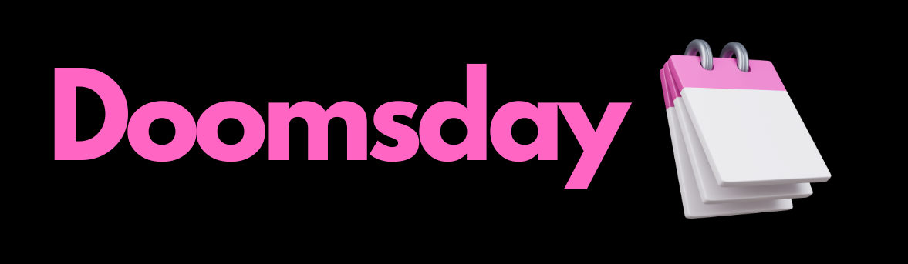

# Web Development Projects

This repository contains all the web projects I have done.

## Projects

## 3D Medical Viewer

A dynamically react workstation for loading DICOM medical images, applying filters, and using marching cubes for image customization.

### Technologies Used

<ul>
  <li>React</li>
  <li>CSS</li>
  <li>VTK.js</li>

</ul>

<a href="https://github.com/Abdelrahmanhassan1/3D-Medical-Viewer-Workstation-With-vtk.js">Github Repository</a>

## Digital Filter Designer

A digital signal processing app that creates custom digital filters using zeros and poles, applies them to a signal for enhancement and noise removal, and shows a real-time graph of the signal after and before enhancement

### Technologies Used

<ul>
  <li>HTML</li>
  <li>CSS</li>
  <li>JavaScript</li>

</ul>

<a href="https://github.com/Abdelrahmanhassan1/Digital-Filter-Designer">Github Repository</a>

## Bank System

A bank application that enables users to create an account and make secure money transactions. The application is designed with a clean interface, allowing users to easily view their account details and transaction history.

### Technologies Used

<ul>
  <li>React</li>
  <li>Node.js</li>
  <li>MongoDB</li>
  <li>Express.js</li>

</ul>

<a href="https://github.com/Abdelrahmanhassan1/Full-Stack-Banking-System">Github Repository</a>

## Memory Game

A game simulates the classic memory game with flipped cards and a number of trials to find the right solution for all pairs of cards that match.

### Technologies Used

<ul>
  <li>HTML</li>
  <li>CSS</li>
  <li>JavaScript</li>

</ul>

<a href="https://github.com/Abdelrahmanhassan1/Memory-Game-Javascript">Github Repository</a>

## Instagram Clone

A responsive MERN stack application for handling users' account creation, and reactions to posts and stories. 

### Technologies Used

<ul>
  <li>React</li>
  <li>Node.js</li>
  <li>MongoDB</li>
  <li>Express.js</li>

</ul>

<a href="https://github.com/Abdelrahmanhassan1/Instagram-Clone">Github Repository</a>

## Expense Tracker

A React app that tracks the expenses of users, adds visual bars of each month's expenses and filters them by year. 

### Technologies Used

<ul>
  <li>React</li>
  <li>CSS</li>
</ul>

<a href="https://github.com/Abdelrahmanhassan1/React-Projects/tree/main/module1-expenses-tracker">Github Repository</a>

## ICU Rooms Handler

A website that serves the ICU rooms by storing patient and doctors' data. 

### Technologies Used

<ul>
  <li>HTML</li>
  <li>CSS</li>
  <li>MYSQL</li>
  <li>Flask</li>

</ul>

<a href="https://github.com/Abdelrahmanhassan1/ICURooms-Web-App-with-Flask">Github Repository</a>

## Inspirational Quote

A Chrome extension to pops up a random quote every time extension clicked and gives alert when social media websites are visted.

### Technologies Used

<ul>
  <li>HTML</li>
  <li>CSS</li>
  <li>JavaScript</li>
</ul>

<a href="https://github.com/Abdelrahmanhassan1/Inspirational-Quote-Chrome-Extension">Github Repository</a>

## Note Keeper

A web application allows users to keep their own notes, edit and delete them, simulating the Google Keep application.

### Technologies Used

<ul>
  <li>React</li>
  <li>CSS</li>
</ul>

<a href="https://github.com/Abdelrahmanhassan1/Note-Keeper-React-App">Github Repository</a>

## To-Do List

A simple to-do list web application that allows users to create, read, update, and delete to-do list items. The application is built using the following technologies:

### Technologies Used

<ul>
  <li>React</li>
  <li>CSS</li>
</ul>

<a href="https://github.com/Abdelrahmanhassan1/To-Do-List-React.Js">Github Repository</a>

## Caesar Cipher Algorithm

An algorithm is used for encryption and decryption of phrases. It is a useful tool for secure communication and information exchange.

### Technologies Used

<ul>
  <li>React</li>
  <li>CSS</li>
</ul>

<a href="https://github.com/Abdelrahmanhassan1/Ceaser-Cipher-React-App">Github Repository</a>

## Doomsday Algorithm

An algorithm returns the weekday of any date provided. It is a useful tool for calculating weekdays for various purposes.

### Technologies Used

<ul>
  <li>HTML</li>
  <li>CSS</li>
  <li>JavaScript</li>
</ul>

<a href="https://github.com/Abdelrahmanhassan1/DoomsDay--How-to-get-the-WeekDay-of-any-Date">Github Repository</a>

## Wikipedia Restful API

 A RESTful API that allows users to search for articles on Wikipedia and get the results in JSON format.

### Technologies Used

<ul>
  <li>Node.js</li>
</ul>

<a href="https://github.com/Abdelrahmanhassan1/Wikipedia-Restful-API">Github Repository</a>

## VEEM 3D Webiste

## PixiCamel

## MRKBA

